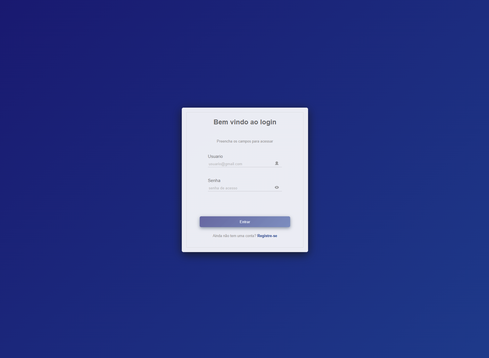
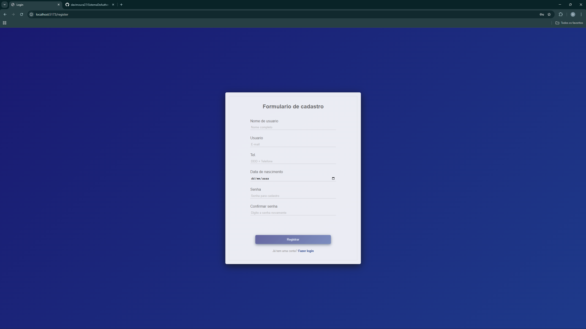
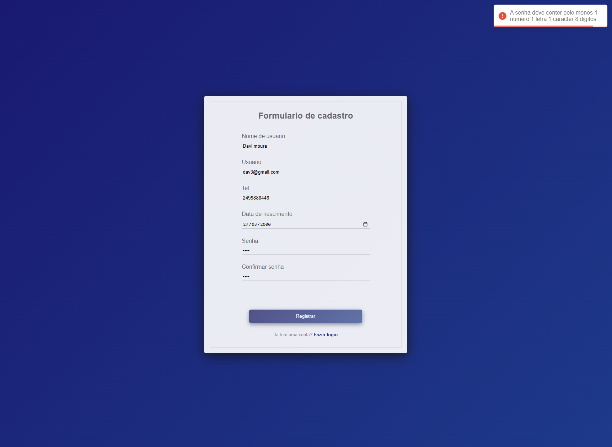
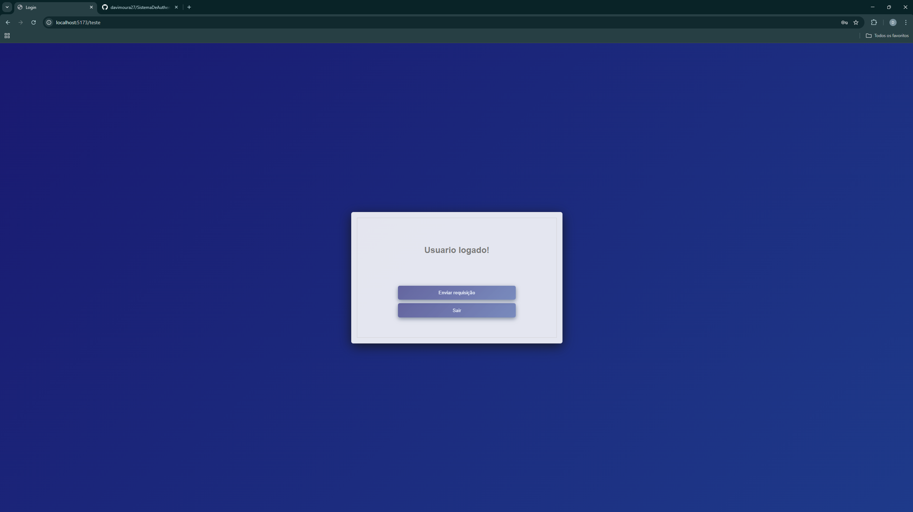
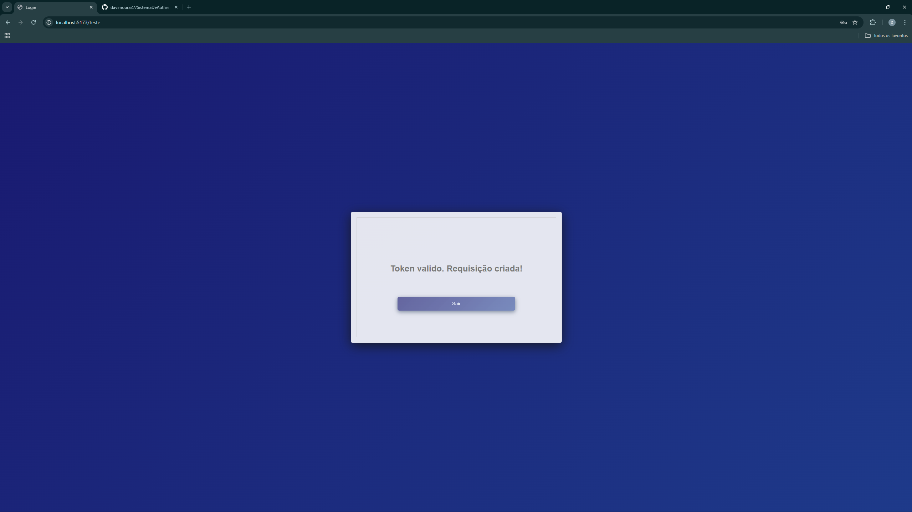
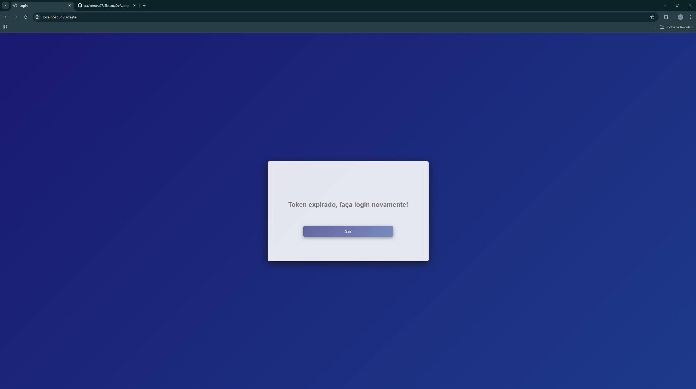

🔐 Sistema de Autenticação com JWT

Este projeto é uma evolução de uma versão anterior que eu havia feito. Decidi recriá-lo para aplicar melhorias, especialmente no backend, deixando o sistema mais robusto, seguro e organizado.
O frontend foi desenvolvido como consequência natural, para trazer uma experiência visual mais elegante e organizada para o usuário.

🚀 Tecnologias utilizadas
Backend

- Spring Boot

- Spring Security

- JWT (JSON Web Token) para autenticação stateless

- BCryptPasswordEncoder para criptografia de senhas

- CORS Config para permitir requisições do frontend

- SecurityFilterChain para configurar a segurança da aplicação

- JwtFilter para validar o token a cada requisição

- JwtUtil para gerar, extrair e validar tokens

- Tratamento de erros personalizado, com exceções próprias e anotações em variáveis

Frontend

- React.js (Vite)

- React Toastify para exibir mensagens de erro e feedback ao usuário

- Confirmação de senha no cadastro para evitar erros de digitação

- Feedback visual: mensagens do backend são capturadas e exibidas em toasts, garantindo uma melhor experiência de uso

📸 Telas do Projeto

Tela de login:

Tela de cadastro:

Tela exemplo de erro com toast:

Tela de Authenticação:

Tela de Validação de token:

Tela de exemplo de token expirado:

 
Sobre o Projeto:

O principal objetivo deste projeto foi aprimorar minhas habilidades no backend, especialmente em autenticação e segurança com JWT.
O frontend foi desenvolvido para acompanhar e tornar a aplicação mais prática, com foco na experiência do usuário.

Esse projeto mostra minha capacidade de:

Criar um sistema seguro e escalável no backend

Organizar e estruturar o frontend para dar suporte às regras de negócio

Trabalhar tanto no tratamento de erros quanto na boa experiência do usuário

👉 Esse é um projeto pessoal de estudo e prática, mas que representa bem minha evolução em Java + Spring Boot e React.js.
